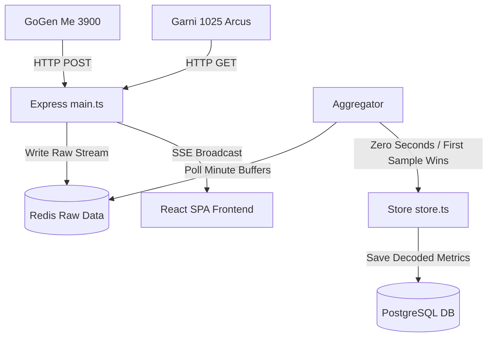

# Met-Hub: Meteorological Dashboard

Met-Hub is a real-time meteorological data collection, storage, and visualization platform. It supports ingestion from various weather station hardware models, real-time telemetry streaming via Server-Sent Events (SSE), and a modern single-page dashboard.

## 1. System Architecture



- **Frontend**: Single Page Application built with React, styled using vanilla CSS, and managed by MobX controllers.
- **Backend (Express API)**: Coordinates user authentication, meteorological configuration registries, and serves raw/aggregated telemetry.
- **Aggregator**: Aggregates raw minute streams into 2-minute clean database rows.
- **Store Consumer**: Parses incoming messages from Redis stream queues and writes them into PostgreSQL tables.
- **Database (PostgreSQL)**: Stores historical telemetry for stations.
- **Cache (Redis)**: Caches MET.no forecasts, astronomical sunrise/sunset data, and maintains active raw minute streams.

## 2. Environment Configurations

Create a `met-hub.env` file in the root directory. Below are the key environment variables:

| Variable | Description | Example |
| --- | --- | --- |
| `PG_HOST` | PostgreSQL Database host | `localhost` |
| `PG_PORT` | PostgreSQL Database port | `5432` |
| `PG_DB` | Database name | `postgres` |
| `PG_USER` | Database username | `postgres` |
| `PG_PASSWORD` | Database password | `postgres` |
| `REDIS_URL` | Redis URL | `redis://localhost:6379` |
| `MY_JWT_SECRET` | Secret key for JWT sign/verification | `your-secret-hex-key` |
| `CLIENT_ID` | Google OAuth Client ID | `your-google-oauth-client-id` |
| `REACT_APP_GOOGLE_CLIENT_ID` | Frontend Client ID reference | `your-google-oauth-client-id` |
| `DOM_PASSKEY` | Passkey for home automation ingestion | `your-dom-passkey` |
| `ENV` | Environment mode (`dev` or `prod`) | `dev` |

## 3. Local Development

### Prerequisites
- Node.js >= 24
- Docker & Docker Compose

### Step 1: Install Dependencies
```bash
npm install --legacy-peer-deps
```

### Step 2: Build the Application
```bash
npm run build
```

### Step 3: Start Services via Docker Compose
To spin up Redis, PostgreSQL, and local Node services:
```bash
docker compose -f docker-compose-local.yml up -d
```
The dashboard will be available at `http://localhost:8089`.

### Step 4: Ingest Test Data
To populate the database tables with test telemetry:
```bash
node scripts/scratch_send_test_data.js
```

## 4. Verification & Testing

- **Linting**:
  ```bash
  npm run lint
  ```
- **TypeScript Typechecking**:
  ```bash
  npx tsc --noEmit
  ```
- **Unit & API Test Suites**:
  ```bash
  npm test
  ```
- **Integration Tests**:
  ```bash
  npm run test:integration
  ```
- **E2E Tests**:
  ```bash
  npm run test:e2e
  ```
