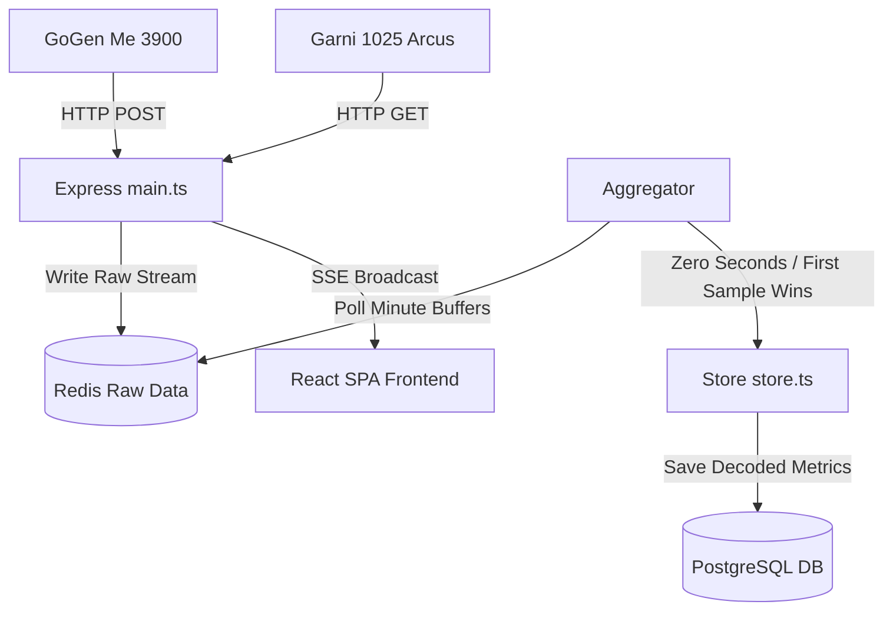

# Met-Hub: Meteorological Dashboard

Met-Hub is a real-time meteorological data collection, storage, and visualization platform. It supports ingestion from various weather station hardware models, real-time telemetry streaming via Server-Sent Events (SSE), and a modern single-page dashboard.

## 1. System Architecture


```mermaid
graph TD
  WS1[GoGen Me 3900] -- HTTP POST --> App[Express main.ts]
  WS2[Garni 1025 Arcus] -- HTTP GET --> App
  App -- Write Raw Stream --> Redis[(Redis Raw Data)]
  Agg[Aggregator] -- Poll Minute Buffers --> Redis
  Agg -- Zero Seconds / First Sample Wins --> StoreTask[Store store.ts]
  StoreTask -- Save Decoded Metrics --> PG[(PostgreSQL DB)]
  App -- SSE Broadcast --> client[React SPA Frontend]
```

- **Frontend**: Single Page Application built with React, styled using vanilla CSS, and managed by MobX controllers.
- **Backend (Express API)**: Coordinates user authentication, meteorological configuration registries, and serves raw/aggregated telemetry.
- **Aggregator**: Aggregates raw minute streams into 2-minute clean database rows.
- **Store Consumer**: Parses incoming messages from Redis stream queues and writes them into PostgreSQL tables.
- **Database (PostgreSQL)**: Stores historical telemetry for stations.
- **Cache (Redis)**: Caches MET.no forecasts, astronomical sunrise/sunset data, and maintains active raw minute streams.

## 2. Environment Configurations

Create a `met-hub.env` file in the root directory. Below are the key environment variables:

| Variable                     | Description                                                                          | Example                       |
| ---------------------------- | ------------------------------------------------------------------------------------ | ----------------------------- |
| `PG_HOST`                    | PostgreSQL Database host                                                             | `localhost`                   |
| `PG_PORT`                    | PostgreSQL Database port                                                             | `5432`                        |
| `PG_DB`                      | Database name                                                                        | `postgres`                    |
| `PG_USER`                    | Database username                                                                    | `postgres`                    |
| `PG_PASSWORD`                | Database password                                                                    | `postgres`                    |
| `REDIS_URL`                  | Redis URL                                                                            | `redis://localhost:6379`      |
| `MY_JWT_SECRET`              | Secret key for JWT sign/verification                                                 | `your-secret-hex-key`         |
| `CLIENT_ID`                  | Google OAuth Client ID                                                               | `your-google-oauth-client-id` |
| `REACT_APP_GOOGLE_CLIENT_ID` | Frontend Client ID reference                                                         | `your-google-oauth-client-id` |
| `DOM_PASSKEY`                | Passkey for home automation ingestion (**required in prod** — boot fails without it) | `your-dom-passkey`            |
| `ENV`                        | Environment mode (`dev` or `prod`)                                                   | `dev`                         |
| `CORS_ORIGIN`                | Allowed browser origin (**required in prod** — boot fails without it)                | `https://www.met-hub.com`     |
| `INGEST_RATE_LIMIT`          | Ingest requests per 10 min per IP (default `600`)                                    | `600`                         |

## 3. Local Development

### Prerequisites

- Node.js >= 24
- Docker & Docker Compose

### Step 1: Install Dependencies

```bash
npm install --legacy-peer-deps
```

### Step 2: Build the Application

```bash
npm run build
```

### Step 3: Start Services via Docker Compose

To spin up Redis, PostgreSQL, and local Node services:

```bash
docker compose -f docker-compose-local.yml up -d --build
```

The dashboard will be available at `http://localhost:8089`. Services
restart automatically (`unless-stopped`) and wait for Redis readiness.
After (re)seeding station config in Redis, restart `met-hub` and
`met-hub-store` (the store process hot-reloads only stations added
through the API).

### Step 4: Ingest Test Data

Either one-off telemetry:

```bash
node scripts/scratch_send_test_data.js
```

or a continuous three-station simulation (GoGen every ~16 s, Garni
every ~30 s, Dom every ~20 s, with realistic day curves):

```bash
node scripts/simulate_local_stations.mjs
```

## 4. Ingestion Authentication

Every data-ingestion endpoint requires a station passkey:

| Endpoint                                       | Protocol                | Passkey location                             | Notes                                                                                                                                                         |
| ---------------------------------------------- | ----------------------- | -------------------------------------------- | ------------------------------------------------------------------------------------------------------------------------------------------------------------- |
| `POST /api/ingest/:stationID`                  | JSON                    | `x-passkey` header (or `PASSKEY` body field) | Exact match required                                                                                                                                          |
| `POST /setData/:stationID`                     | Ecowitt-style (WS View) | `PASSKEY` body field                         | Exact match required; stations provisioned with the legacy `"dummy"` sentinel accept any value — re-provision them with a real ≥12-char passkey when possible |
| `POST /setData`, `POST /data/report`           | WU/Ecowitt body upload  | `PASSKEY` body field                         | Station looked up by passkey                                                                                                                                  |
| `GET /weatherstation/updateweatherstation.php` | Weather Underground     | `ID` query parameter                         | The device's `ID` must equal the station passkey                                                                                                              |
| `POST /setDomData`                             | Smart-home JSON         | `PASSKEY` query/body/header                  | Must equal `DOM_PASSKEY`                                                                                                                                      |

Passkeys are user-supplied at station creation, must be at least 12 characters, and cannot be the reserved value `"dummy"`. Samples dated more than 5 minutes in the future or more than 1 hour in the past are rejected.

## 5. Station Management

Signed-in users can add stations via the header menu (**Add new
station**). Rules enforced by `POST /api/addStation`:

- passkey: at least 12 characters, `"dummy"` reserved
- max 3 stations per user
- station IDs are random 8-char hex; the PostgreSQL table is created
  automatically and the config is hot-reloaded into the store service

New stations appear in the selector immediately after creation. There
is currently no delete/toggle endpoint — edit `ALL_STATIONS_CFG` in
Redis and restart the services if needed.

The Dom (smart-home) station is built in: it appears in the selector
only for the account matching `DOM_ACCESS_EMAIL` in
`server/router.ts`.

## 6. Verification & Testing

- **Linting**:
  ```bash
  npm run lint
  ```
- **TypeScript Typechecking**:
  ```bash
  npx tsc --noEmit
  ```
- **Unit & API Test Suites**:
  ```bash
  npm test
  ```
- **Integration Tests**:
  ```bash
  npm run test:integration
  ```
- **E2E Tests** (expects the app on `:8089`, or set it loose in
  `playwright.config.ts`; browsers via `npx playwright install`):
  ```bash
  npm run test:e2e
  ```
  On networks where the Playwright CDN is unreachable, point a local
  config at system Chrome with `channel: "chrome"`.

## 7. Deployment

CI (`.github/workflows/main.yml`) runs on every push to `master`:
lint → typecheck → unit/API tests → Docker build → push to
`ghcr.io/lubod/met-hub{,-store}` tagged with the commit SHA and
`latest`. The prod host's `upgrade` script pulls `:latest` and
restarts.

Notes for the prod host:

- `DOM_PASSKEY` and `CORS_ORIGIN` must be set, or the API container
  refuses to boot.
- `default.conf` references `snippets/self-signed.conf` and Certbot
  certificates under `/etc/letsencrypt/` — these exist only on the
  host; keep them in sync when rebuilding nginx there.
- After upgrading, clients fetch the new bundle on first reload
  (service worker cache version is bumped in `public/sw.js`).

## 8. Development Notes

- **Tailwind palette is overridden** in `tailwind.config.js` — the
  default palette (`slate-*`, `blue-*`, …) does not exist. Use the
  custom names (`light`, `dark`, `blue`, `cyan`, …) or arbitrary
  values like `bg-[#e2e8f0]`; standard-palette classes silently
  compile to nothing.
- Station config lives in the Redis hash `ALL_STATIONS_CFG`; the web
  and store processes load it at boot, and the store hot-reloads on
  the `STATIONS_CFG_CHANGED` pub/sub channel.
- Raw samples are aggregated once per minute; the raw window is
  consumed atomically (Lua), aggregated minutes flow through the
  `toStore` stream into PostgreSQL, and failures land in
  `toStore:DLQ`.
